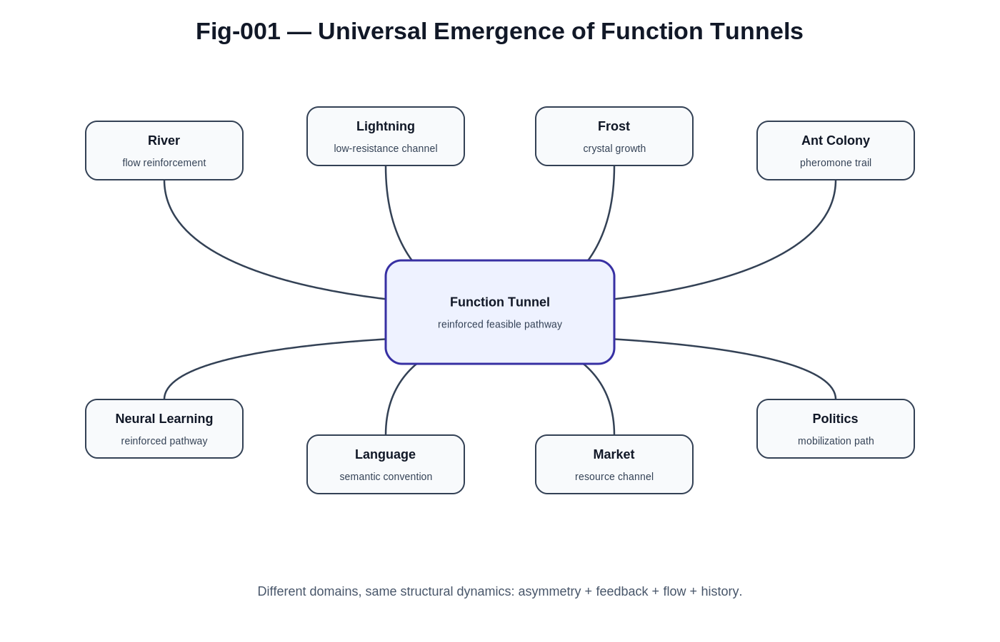
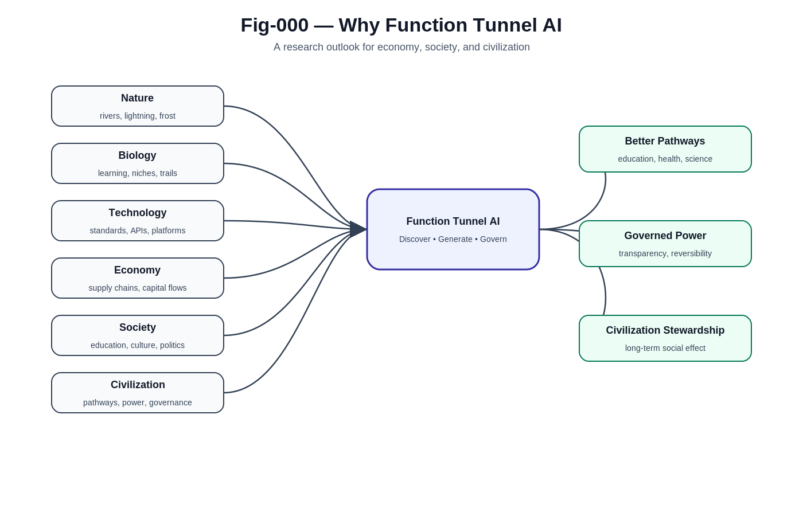
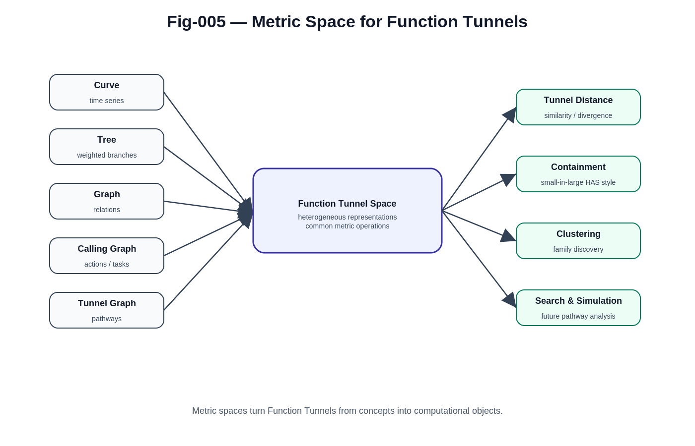
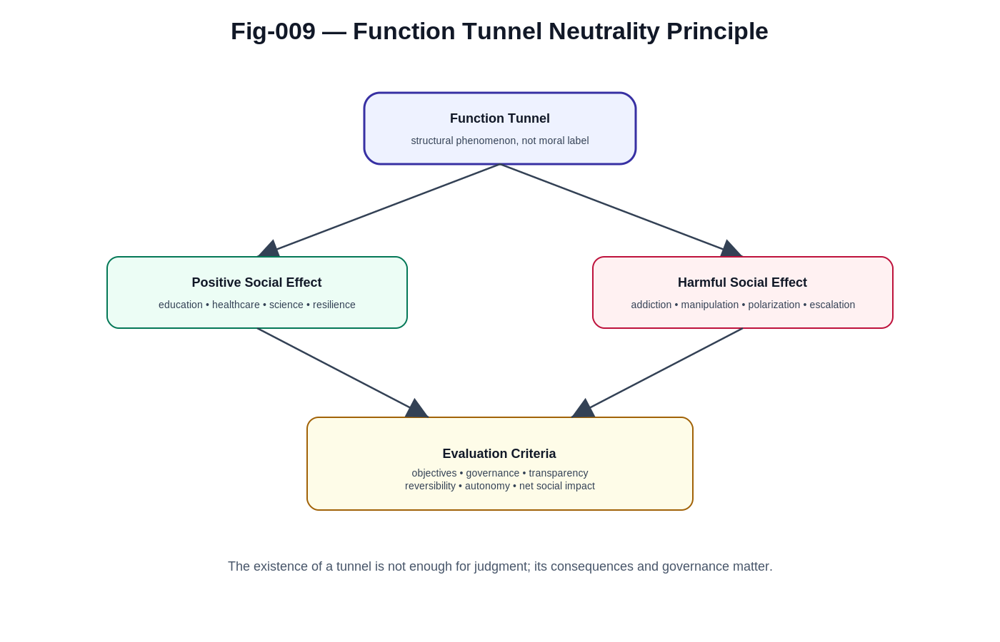
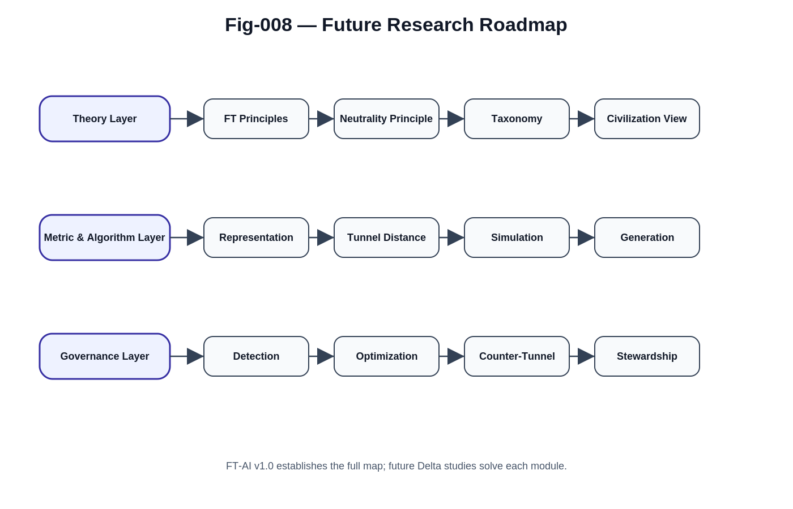

# Function Tunnel AI

## A Research Outlook for Economy, Society, and Civilization

> Understanding, Generating, Governing, and Defending the Pathways Through Which Complex Systems Evolve.

---

## Overview

Artificial Intelligence has traditionally focused on perception, prediction, reasoning, optimization, and decision-making.

Function Tunnel AI (FT-AI) proposes a complementary perspective.

Many natural, biological, technological, economic, social, political, and civilizational systems do not evolve through arbitrary trajectories.

Instead, they frequently converge into a limited number of feasible, reinforced, and self-stabilizing pathways.

This repository refers to such pathways as:

# Function Tunnels



Examples appear throughout nature and society:

* rivers,
* lightning channels,
* crystal growth,
* ecological migration routes,
* neural learning pathways,
* educational systems,
* technological ecosystems,
* economic infrastructures,
* social influence networks,
* political mobilization systems,
* military escalation pathways,
* civilization-scale development processes.

As Artificial Intelligence becomes increasingly capable of discovering and shaping these pathways, understanding Function Tunnels may become one of the most important research challenges of the twenty-first century.

---

Function Tunnels are not proposed as inherently beneficial or harmful.

They are structural phenomena that emerge naturally across complex systems.

See: [FUNCTION-TUNNEL-NEUTRALITY-PRINCIPLE.md](./docs/003-FUNCTION-TUNNEL-NEUTRALITY-PRINCIPLE.md)

---

# Core Thesis

---


---

The central hypothesis of this project is:

> Complex systems often evolve through a relatively small number of feasible pathways rather than through unrestricted exploration.

These pathways emerge when:

```text
Random Exploration
+
Asymmetry
+
Feedback
+
Resource Flow
+
Historical Accumulation
=
Function Tunnel
```

Function Tunnels are therefore not limited to technology or human society.

They are structural phenomena that appear across many classes of complex systems.

---

# Why This Research Matters

---



---

Historically, Function Tunnels emerged gradually.

Civilizations required decades, centuries, or even millennia to discover and reinforce successful pathways.

Artificial Intelligence changes this situation.

Future AI systems may become capable of:

* discovering hidden tunnels,
* predicting emerging tunnels,
* generating new tunnels,
* optimizing tunnel structures,
* governing harmful tunnels,
* defending against tunnel hijacking.

This capability introduces both extraordinary opportunities and extraordinary risks.

The challenge is no longer merely:

> What can AI do?

The deeper question becomes:

> Which pathways will AI help create, reinforce, optimize, or control?

---

# Core Research Questions

---



---

Function Tunnel AI investigates several fundamental questions.

### Discovery

How can hidden Function Tunnels be detected?

### Representation

How should Function Tunnels be represented computationally?

### Distance

How can similarities, differences, and containment relationships be measured?

### Simulation

How can tunnel evolution be predicted?

### Generation

Can beneficial tunnels be intentionally constructed?

### Governance

How can harmful tunnels be detected and managed?

### Defense

How can societies resist tunnel hijacking?

### Civilization

What role will Function Tunnel AI play in the future development of economy, society, and civilization?

---

# Function Tunnel Neutrality Principle

---



---

One of the most important principles of this project is:

> Function Tunnels are structurally neutral phenomena.

The existence of a Function Tunnel does not, by itself, imply either benefit or harm.

Function Tunnels exist throughout:

* nature,
* biology,
* cognition,
* education,
* economics,
* technology,
* politics,
* civilization.

Their significance depends upon:

* objectives,
* governance,
* transparency,
* reversibility,
* societal consequences.

The central challenge is therefore not whether Function Tunnels exist.

The challenge is understanding which Function Tunnels contribute positively to individuals, societies, and civilizations.

---

# Repository Structure

```text
docs/

├── 001-FUNCTION-TUNNEL-AI.md
├── 002-WHY-FUNCTION-TUNNELS.md
├── 003-FUNCTION-TUNNEL-NEUTRALITY-PRINCIPLE.md
├── 004-FUNCTION-TUNNEL-TAXONOMY.md
├── 005-FUNCTION-TUNNEL-METRIC-SPACES.md
├── 006-FUNCTION-TUNNEL-GENERATION-AND-GOVERNANCE.md
├── 007-FUNCTION-TUNNEL-AI-AND-CIVILIZATION.md
├── 008-OPEN-PROBLEMS.md

figures/

├── Fig-000-Why-Function-Tunnel-AI
├── Fig-001-Universal-Emergence-of-Function-Tunnels
├── Fig-002-Tunnel-Formation-Principle
├── Fig-003-Function-Tunnel-Taxonomy
├── Fig-004-Function-Tunnel-Lifecycle
├── Fig-005-Metric-Space-for-Function-Tunnels
├── Fig-006-Positive-vs-Hijacking-Tunnels
├── Fig-007-Function-Tunnel-AI-and-Society
├── Fig-008-Future-Research-Roadmap
├── Fig-009-Function-Tunnel-Neutrality-Principle
```

---

# Relationship to Other Research Directions

Function Tunnel AI is closely related to several ongoing research programs.

### Structural Intelligence (SI)

Provides the broader framework for understanding structural evolution.

### Function Tunnel Intelligence (FTI)

Focuses on tunnel-preserved evolution and feasible transformation.

### Function Tunnel Networks (FTN)

Studies tunnel interaction, emergence, competition, and ecosystem dynamics.

### Function Tunnel Capital (FTC)

Investigates human expertise, capability accumulation, and career development through tunnel formation.

### Autonomous Structural Intelligence (ASI)

Explores AI systems capable of navigating structural pathways autonomously.

### Human-AI Hybrid Civilization

Examines the co-evolution of human and AI tunnel ecosystems.

### Emergency Intelligence

Studies tunnel disruption, recovery, adaptation, and resilience under extreme conditions.

Together these directions contribute to a broader effort to understand how complex systems evolve and how Artificial Intelligence may participate in that evolution.

---

# What This Repository Is

This repository is:

* a research outlook,
* a conceptual framework,
* an open research program,
* a collection of hypotheses,
* a roadmap for future investigation.

It is not intended to present a complete theory.

Many of the most important questions remain unresolved.

The purpose of this work is to identify those questions and encourage future exploration.

---

# Open Problems

---



---

Major challenges include:

* Function Tunnel Representation
* Function Tunnel Distance
* Automatic Tunnel Discovery
* Tunnel Family Clustering
* Tunnel Evolution Modeling
* Tunnel Simulation
* Tunnel Generation
* Tunnel Optimization
* Tunnel Governance
* Tunnel Defense
* Civilization-Scale Tunnel Ecosystems

These challenges may define a substantial research agenda for years to come.

---

# Looking Forward

The twentieth century was shaped by energy, industry, computation, and information.

The twenty-first century may increasingly be shaped by pathways.

Not merely information.

Not merely intelligence.

But the ability to understand, generate, optimize, govern, and defend the pathways through which intelligence, economies, societies, and civilizations evolve.

Function Tunnel AI is proposed as an early step toward exploring this frontier.

---

## Final Remark

The value of Function Tunnel AI may ultimately lie not in the answers it currently provides.

Its value may lie in the questions it encourages humanity to ask.

How do pathways emerge?

Why do some pathways dominate?

How can beneficial pathways be strengthened?

How can harmful pathways be governed?

And perhaps most importantly:

> How can humanity participate responsibly in shaping the pathways through which its future unfolds?


---

## Author

Sizhe Tan\
Independent Researcher

GPT-Obot\
AI Research Assistant

2026

## Citation

DOI: TBD

## License

Apache-2.0

---

## 📚 DBM-SI Series Navigation

See:\
[./docs/DBM-SI-Series-of-gitHub-Repositories/DBM-SI-Series-of-gitHub-Repositories.md](./docs/DBM-SI-Series-of-gitHub-Repositories/DBM-SI-Series-of-gitHub-Repositories.md)

[./docs/DBM-SI-Series-of-gitHub-Repositories/DBM-SI-Structural-Intelligence-Dictionary-(v2).md](./docs/DBM-SI-Series-of-gitHub-Repositories/DBM-SI-Structural-Intelligence-Dictionary-(v2).md)
