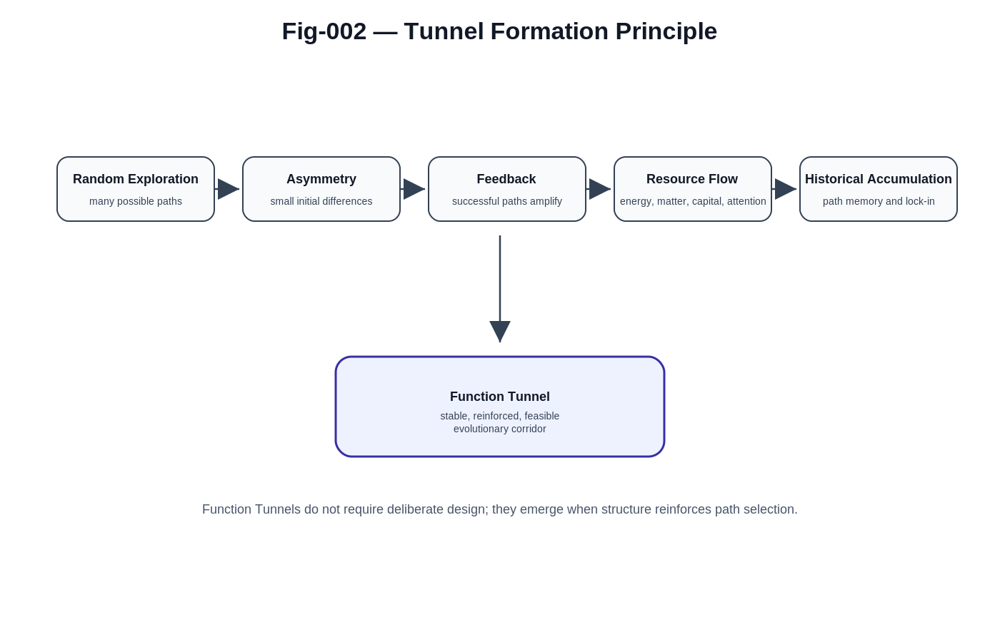

# Why Function Tunnels?

## From Randomness to Structured Evolution

### Abstract

One of the most common questions raised when discussing Function Tunnel AI is:

> Why should Function Tunnels be considered a universal phenomenon?

At first glance, many systems appear to evolve randomly. Rivers seem to follow accidental paths. Technological ecosystems appear to emerge from countless independent decisions. Economic markets fluctuate unpredictably. Human societies often appear chaotic and difficult to predict.

However, closer examination reveals a recurring pattern.

Across nature, biology, technology, economics, politics, and civilization, evolution rarely remains uniformly random. Instead, systems tend to converge into a limited number of reinforced, self-stabilizing, and historically accumulated pathways.

This document argues that Function Tunnels emerge naturally whenever randomness interacts with asymmetry, feedback mechanisms, resource flows, and historical accumulation.

The widespread appearance of Function Tunnels may therefore be understood not as a special case, but as a fundamental organizational principle of complex systems.

---


---

# 1. The Misconception of Randomness

A common intuition is that randomness leads to disorder.

While this is partially true in isolated systems, many real-world systems are not isolated.

They contain:

* resource flows,
* structural asymmetries,
* reinforcement mechanisms,
* historical memory,
* environmental constraints.

Under such conditions, randomness often produces organization rather than chaos.

The important observation is:

> Random exploration does not necessarily remain random.

Small differences can become amplified.

Preferred paths can emerge.

Stable structures can form.

Over time, these structures become Function Tunnels.

---

# 2. A General Formation Principle

The central hypothesis of Function Tunnel theory may be summarized as:

```text
Random Exploration
+
Asymmetry
+
Feedback
+
Resource Flow
+
Historical Accumulation
=
Function Tunnel
```

Each component plays a distinct role.

### Random Exploration

Provides diversity of possible paths.

### Asymmetry

Creates initial differences between paths.

### Feedback

Amplifies successful paths.

### Resource Flow

Supplies energy, information, capital, attention, or matter.

### Historical Accumulation

Preserves and reinforces previously successful structures.

Together they create stable evolutionary corridors.

These corridors are Function Tunnels.

---

# 3. Rivers: The Simplest Function Tunnel

A river provides one of the clearest examples.

Rain falls over a landscape.

Initially, water distribution is largely random.

However, tiny differences in terrain create slight flow preferences.

Once more water travels through a small depression:

* erosion increases,
* the channel deepens,
* resistance decreases,
* additional water follows the same path.

A positive feedback loop emerges.

The process may be described as:

```text
Random Flow
→ Small Groove
→ Stream
→ River
→ River Network
```

Eventually, countless possible trajectories collapse into a small number of stable pathways.

A Function Tunnel has emerged.

Importantly, no designer is required.

The tunnel forms naturally.

---

# 4. Frost Patterns on Winter Windows

Frost flowers provide another example.

Water vapor initially distributes itself randomly.

At certain locations, microscopic crystal nuclei form.

These nuclei slightly increase the probability of further deposition.

The resulting process is self-reinforcing:

```text
Crystal Nucleus
→ Local Growth
→ Enhanced Attraction
→ Branch Formation
→ Structured Frost Pattern
```

The final pattern appears highly organized despite originating from random molecular motion.

The crystal effectively creates growth tunnels for future molecules.

---

# 5. Lightning Channels

Lightning is often perceived as chaotic.

Yet electrical discharge follows a tunnel-forming process.

Numerous discharge paths are theoretically possible.

A small ionized region lowers electrical resistance.

Lower resistance attracts additional current.

Additional current further lowers resistance.

The process repeats until a dominant discharge channel forms.

The resulting lightning path is not purely random.

It is a Function Tunnel for energy flow.

---

# 6. Ant Colony Trails

Ant colonies provide one of the earliest biological demonstrations of tunnel formation.

Individual ants explore randomly.

Successful paths become marked by pheromones.

Pheromones attract additional ants.

More ants deposit additional pheromones.

The trail strengthens.

The process creates an information tunnel:

```text
Random Exploration
→ Successful Route
→ Pheromone Trail
→ Reinforcement
→ Stable Ant Highway
```

The colony collectively constructs a preferred evolutionary path.

---

# 7. Neural Pathways and Learning

The human brain demonstrates a similar principle.

A newborn brain contains enormous numbers of potential neural pathways.

Learning strengthens some pathways while weakening others.

Repeated activation increases connection strength.

The classic neuroscience principle states:

> Neurons that fire together wire together.

Over time:

```text
Activation
→ Reinforcement
→ Easier Activation
→ Further Reinforcement
```

The result is the formation of cognitive Function Tunnels.

Learning itself may be viewed as tunnel construction.

---

# 8. Language and Cultural Evolution

Human languages also exhibit tunnel dynamics.

Infinite expressions are theoretically possible.

Yet societies converge on relatively small sets of words, grammatical structures, and conventions.

Repeated use creates reinforcement.

Education preserves successful forms.

Communication efficiency favors established pathways.

Language therefore evolves through semantic Function Tunnels.

---

# 9. Technological Ecosystems

Technological systems provide particularly powerful examples.

Numerous protocols, standards, and architectures compete during early development.

Over time:

```text
Adoption
→ Ecosystem Growth
→ Compatibility Benefits
→ Increased Adoption
```

A positive feedback loop emerges.

Examples include:

* TCP/IP
* HTML
* Linux
* Git
* Java
* Android

Each became a dominant pathway within a broader technological landscape.

These are technological Function Tunnels.

---

# 10. Economic and Social Function Tunnels

Economic systems demonstrate similar behavior.

Supply chains.

Financial infrastructures.

Trade routes.

Industrial standards.

Labor specialization.

Platform ecosystems.

All exhibit path dependence.

Once a pathway accumulates sufficient resources, participants, and institutional support, alternative paths become increasingly difficult to establish.

Economic evolution therefore frequently follows tunnel structures.

---

# 11. Why Function Tunnels Appear Universal

The examples above differ dramatically in scale and domain.

Yet they share a common structure.

They all involve:

* multiple possible futures,
* slight initial asymmetries,
* reinforcement mechanisms,
* resource concentration,
* historical accumulation.

The universality of Function Tunnels does not arise because rivers, brains, economies, and societies are identical.

Rather, it arises because they share similar evolutionary dynamics.

Function Tunnels emerge whenever complex systems repeatedly reinforce successful pathways.

---

# 12. Function Tunnels and Artificial Intelligence

The significance of this observation increases dramatically in the AI era.

Historically, Function Tunnels emerged slowly.

Natural processes required years, decades, centuries, or even millennia.

AI changes the situation.

Future AI systems may become capable of:

* discovering hidden tunnels,
* predicting tunnel formation,
* generating new tunnels,
* optimizing tunnel efficiency,
* defending against harmful tunnels,
* governing tunnel evolution.

This transforms Function Tunnels from a descriptive concept into an engineering discipline.

---

# 13. A New Perspective on Civilization

Perhaps the deepest implication of Function Tunnel theory is that civilization itself may be viewed as a network of interacting tunnels.

Scientific progress.

Educational systems.

Economic infrastructures.

Political institutions.

Technological ecosystems.

Cultural traditions.

All can be interpreted as Function Tunnel networks operating at different scales.

Civilization is therefore not merely a collection of events.

It may be understood as a continuously evolving landscape of interacting Function Tunnels.

---

# Conclusion

---



---

Function Tunnels do not require intentional design.

They emerge naturally whenever complex systems contain:

* asymmetry,
* feedback,
* resource flow,
* historical accumulation.

From rivers to neural pathways, from technological standards to civilization-scale institutions, the same structural principle repeatedly appears.

The purpose of Function Tunnel AI is therefore not merely to create Function Tunnels.

Its broader mission is to discover, understand, optimize, govern, and defend them.

Understanding why Function Tunnels emerge may be one of the first steps toward understanding how complex systems evolve—and how humanity can guide that evolution responsibly in the age of AI.
