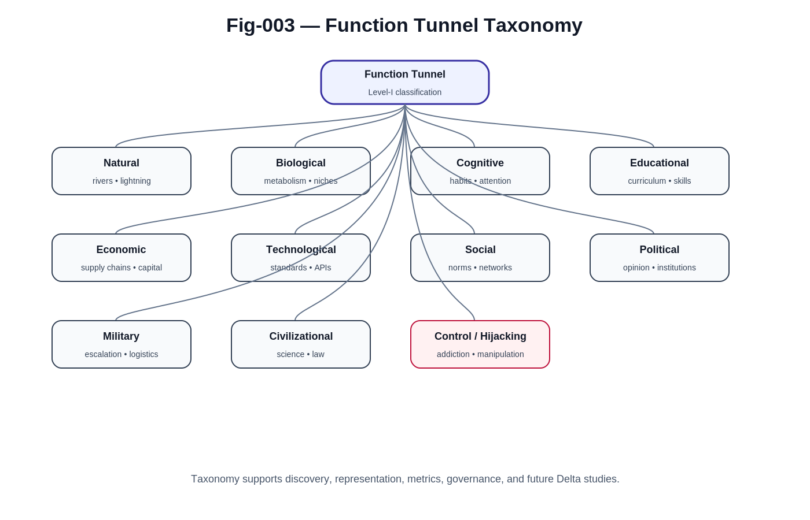

# Function Tunnel Taxonomy

## A Classification Framework for Function Tunnel AI

### Abstract

Function Tunnels appear across a remarkable variety of domains.

They can be observed in river systems, biological evolution, neural learning, technological ecosystems, economic infrastructures, social networks, political systems, military escalation processes, and civilization-scale development.

The existence of Function Tunnels across such diverse environments suggests that they are not domain-specific phenomena, but manifestations of a broader structural principle governing complex systems.

To study, compare, simulate, optimize, and govern Function Tunnels, a systematic classification framework is required.

This document proposes an initial taxonomy for Function Tunnel AI.

The purpose of the taxonomy is not to provide a final classification, but to establish a common language for future research.

---



---

# 1. Why Classification Matters

Scientific progress often begins with classification.

Biology required taxonomy before evolutionary theory.

Chemistry required element classification before modern chemistry.

Astronomy required star classification before stellar evolution could be understood.

Similarly, Function Tunnel AI requires a systematic framework for describing different tunnel families.

Without classification:

* observations remain isolated,
* patterns remain hidden,
* algorithms remain domain-specific.

A Function Tunnel taxonomy allows researchers to recognize common structures across seemingly unrelated systems.

---

# 2. A Multi-Layer Classification Principle

Function Tunnels may be classified according to:

### Domain

Where the tunnel operates.

### Function

What purpose the tunnel serves.

### Dynamics

How the tunnel evolves.

### Governance Risk

Whether the tunnel primarily benefits or exploits participants.

These dimensions are independent and may overlap.

A single Function Tunnel can belong to multiple categories simultaneously.

---

# 3. Level-I Classification

The first layer of the taxonomy identifies the major tunnel families.

```text
Function Tunnel
│
├── Natural Function Tunnels
├── Biological Function Tunnels
├── Cognitive Function Tunnels
├── Educational Function Tunnels
├── Economic Function Tunnels
├── Technological Function Tunnels
├── Social Function Tunnels
├── Political Function Tunnels
├── Military Function Tunnels
├── Civilizational Function Tunnels
└── Control / Hijacking Function Tunnels
```

This classification reflects the primary domain in which a tunnel operates.

---

# 4. Natural Function Tunnels

Natural Function Tunnels emerge without intentional design.

They are produced through physical, chemical, geological, or ecological processes.

Examples include:

* rivers,
* ocean currents,
* lightning channels,
* crystal growth,
* erosion paths,
* glacier movement,
* ecological migration routes.

### Core Research Question

How do Function Tunnels emerge spontaneously from natural processes?

### Importance

Natural Function Tunnels provide the foundational intuition for understanding tunnel formation in more complex systems.

---

# 5. Biological Function Tunnels

Biological systems frequently evolve through constrained pathways.

Examples include:

* metabolic pathways,
* evolutionary niches,
* neural reinforcement patterns,
* collective animal behavior,
* migration routes,
* ecological food chains.

### Core Research Question

How does life create and maintain stable evolutionary corridors?

### Importance

Biological Function Tunnels represent some of the most successful adaptive systems known.

---

# 6. Cognitive Function Tunnels

Cognitive Function Tunnels exist within minds.

Examples include:

* habits,
* reasoning patterns,
* memory reinforcement pathways,
* expertise formation,
* emotional loops,
* attention channels.

### Core Research Question

How do repeated cognitive activities form persistent mental pathways?

### Importance

Understanding Cognitive Function Tunnels is essential for education, mental health, and future AI-human interaction.

---

# 7. Educational Function Tunnels

Educational systems create structured learning pathways.

Examples include:

* conceptual dependency chains,
* curriculum progression,
* skill acquisition routes,
* apprenticeship systems,
* professional training pipelines.

### Core Research Question

How can beneficial learning tunnels be constructed and optimized?

### Importance

Educational Function Tunnels may become one of the most important positive applications of Function Tunnel AI.

---

# 8. Economic Function Tunnels

Economic systems contain numerous tunnel structures.

Examples include:

* trade routes,
* supply chains,
* industrial ecosystems,
* labor specialization,
* capital flows,
* platform economies.

### Core Research Question

How do economic pathways emerge, dominate, and decline?

### Importance

Economic Function Tunnels strongly influence wealth creation and resource allocation.

---

# 9. Technological Function Tunnels

Technology evolves through highly constrained pathways.

Examples include:

* protocol adoption,
* standards formation,
* software ecosystems,
* API networks,
* hardware architectures,
* developer workflows.

Examples include:

* TCP/IP
* Linux
* Git
* Java
* Android

### Core Research Question

Why do certain technologies become dominant pathways?

### Importance

Technological Function Tunnels determine much of modern innovation and industrial development.

---

# 10. Social Function Tunnels

Social systems exhibit large-scale tunnel dynamics.

Examples include:

* social norms,
* cultural practices,
* community structures,
* social influence networks,
* reputation systems,
* viral diffusion patterns.

### Core Research Question

How do social behaviors become self-reinforcing?

### Importance

Social Function Tunnels shape collective behavior and societal stability.

---

# 11. Political Function Tunnels

Political systems often evolve through strongly constrained pathways.

Examples include:

* political mobilization,
* ideological diffusion,
* institutional development,
* governance structures,
* public opinion dynamics.

### Core Research Question

How do political pathways become dominant?

### Importance

Political Function Tunnels influence national and international stability.

---

# 12. Military Function Tunnels

Military systems frequently exhibit tunnel behavior.

Examples include:

* escalation pathways,
* arms races,
* alliance formation,
* strategic doctrines,
* military-industrial ecosystems.

### Core Research Question

How do conflicts enter self-reinforcing escalation tunnels?

### Importance

Military Function Tunnels may become critical areas for future AI governance and security research.

---

# 13. Civilizational Function Tunnels

Civilizations themselves may be viewed as collections of interacting Function Tunnels.

Examples include:

* scientific progress,
* educational systems,
* legal systems,
* governance institutions,
* technological infrastructures,
* cultural traditions.

### Core Research Question

How do civilizations construct and maintain long-term evolutionary pathways?

### Importance

This category represents the largest scale currently considered within Function Tunnel AI.

---

# 14. Control and Hijacking Function Tunnels

Some tunnels exploit rather than empower participants.

Examples include:

* addiction loops,
* dependency structures,
* manipulation systems,
* polarization mechanisms,
* coercive influence networks,
* information capture systems.

### Core Research Question

How can harmful tunnels be detected, analyzed, and governed?

### Importance

This category represents one of the most significant governance challenges of the AI era.

---

# 15. Positive vs Negative Function Tunnels

Function Tunnels should not be classified solely by domain.

A second classification dimension concerns social impact.

### Positive Tunnels

Examples:

* education,
* scientific collaboration,
* healthcare recovery,
* economic development,
* disaster response.

These tunnels generally expand human capability.

### Negative Tunnels

Examples:

* addiction,
* manipulation,
* dependency,
* polarization,
* escalation.

These tunnels often reduce autonomy or increase systemic risk.

Future governance systems must distinguish between the two.

---

# 16. Open Classification Challenges

The taxonomy proposed here is intentionally incomplete.

Several important questions remain unresolved.

### Hybrid Tunnels

Many tunnels operate across multiple domains simultaneously.

For example:

A social media platform may simultaneously be:

* technological,
* economic,
* social,
* political,
* cognitive.

### Dynamic Tunnels

Some tunnels continuously change structure.

How should evolving tunnels be classified?

### Nested Tunnels

Small tunnels may exist within larger tunnels.

How should hierarchical tunnel systems be represented?

### Tunnel Ecosystems

Civilizations contain large numbers of interacting tunnels.

How should tunnel networks be classified?

These questions remain open research problems.

---

# 17. Toward a Unified Tunnel Science

The ultimate purpose of Function Tunnel Taxonomy is not classification itself.

Its purpose is to establish a foundation for:

* tunnel discovery,
* tunnel representation,
* tunnel simulation,
* tunnel optimization,
* tunnel governance,
* tunnel defense.

A mature taxonomy may eventually play a role analogous to biological taxonomy in the life sciences.

It provides a common language through which diverse Function Tunnel phenomena can be studied within a unified framework.

---

# Conclusion

Function Tunnels appear across nature, biology, cognition, education, technology, economics, society, politics, warfare, and civilization.

Although these domains differ dramatically, they often exhibit similar structural dynamics:

* path dependence,
* reinforcement,
* resource concentration,
* historical accumulation.

The taxonomy proposed in this document represents an initial attempt to organize this emerging field.

It is not intended as a final classification.

Rather, it serves as a foundation for future research into one of the central questions of Function Tunnel AI:

> What kinds of pathways shape the evolution of complex systems, and how can humanity understand, guide, and govern them responsibly?
